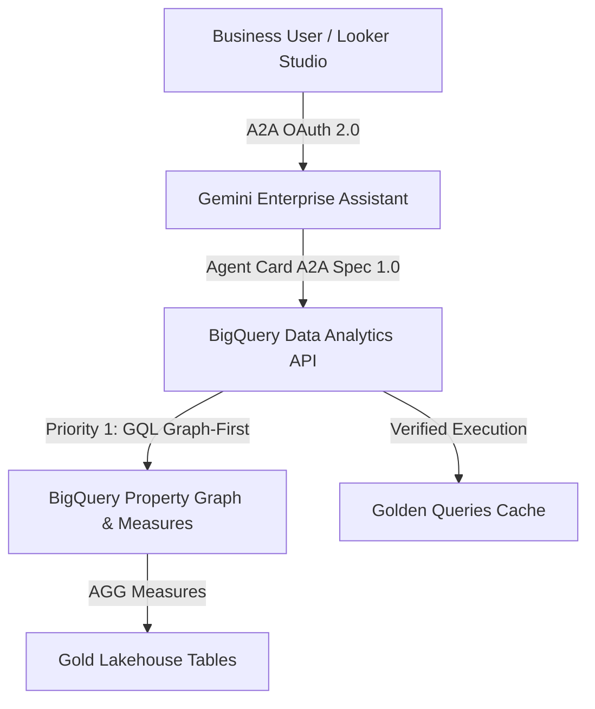
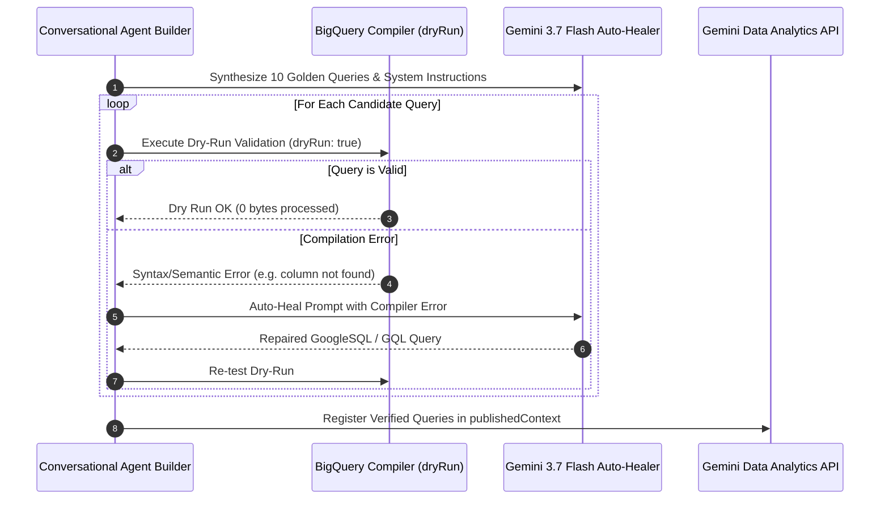

# BigQuery Conversational Agent Builder & Golden Queries Best Practices

This skill defines the official, enterprise-grade standards for architecting, creating, testing, and federating **BigQuery Conversational Analytics Agents** (`geminidataanalytics.googleapis.com`) and publishing them via **Agent2Agent (A2A)** into **Gemini Enterprise Discovery Engine** (`discoveryengine.googleapis.com`).

---

## 1. Core Architecture & API Overview



### Key API & Service Specifications
- **Data Analytics API Service**: `geminidataanalytics.googleapis.com` (`v1beta` or `v1`)
- **Parent Resource Path**: `projects/{projectId}/locations/{location}/dataAgents/{agentId}`
- **Default LLM Engine**: `gemini-3.7-flash` (Vertex AI)
- **Agent Lifecycle**: 30-day soft-deletion grace period on GCP (`SOFT_DELETED`). Re-creation requires generating a new unique agent ID suffix.
- **Discovery Engine Endpoint**: `https://discoveryengine.googleapis.com/v1alpha/projects/{project}/locations/global/authorizations`
- **A2A Protocol Version**: `protocolVersion: "1.0"` with `"version": "1.0.0"`.

---

## 2. IAM Roles & Security Best Practices

The Conversational Analytics API operates strictly on a **read-only** paradigm (blocking DDL/DML and running dry-run test validations). BigQuery queries are executed under the **end-user's / caller's IAM identity**, not the agent's identity.

| Role Name | IAM Role ID | Purpose / Responsibilities |
| :--- | :--- | :--- |
| **Data Agent Creator** | `roles/geminidataanalytics.dataAgentCreator` | Creates new Data Agents in the project. (Automatically gains Owner). |
| **Data Agent Owner** | `roles/geminidataanalytics.dataAgentOwner` | Manages sharing, updates labels, and deletes agents. |
| **Data Agent Editor** | `roles/geminidataanalytics.dataAgentEditor` | Updates `publishedContext`, System Instructions, and Golden Queries. |
| **Data Agent User** | `roles/geminidataanalytics.dataAgentUser` | Interacts with the agent via chat/API in natural language. |
| **End-User Data Access** | `roles/bigquery.dataViewer` + `roles/bigquery.jobUser` | Required on underlying BigQuery datasets/tables to execute generated SQL. |

---

## 3. Mandatory "Graph-First" Grounding & Discovery Standard

> [!IMPORTANT]
> **Graph-First Mandate**: In this project and architecture, conversational agents **MUST ALWAYS prioritize grounding on a BigQuery Property Graph** (`CREATE OR REPLACE PROPERTY GRAPH`) with Semantic Measures (`MEASURE(...) AS measure_name`). A Property Graph is the canonical semantic layer representing multi-entity relationships and preventing metric fan-out.

### 3.1. The 3-Tier Auto-Discovery Protocol
Whenever provisioning or configuring a BigQuery Conversational Agent, always follow this discovery hierarchy:

1. **Tier 1 (Default - Pure Property Graph Grounding)**:
   - Query `INFORMATION_SCHEMA.PROPERTY_GRAPHS` in the target dataset (`datasetId`):
     ```sql
     SELECT property_graph_name, ddl 
     FROM `{projectId}.{datasetId}.INFORMATION_SCHEMA.PROPERTY_GRAPHS` 
     LIMIT 10;
     ```
   - If a Property Graph exists, bind it **exclusively** as `datasourceReferences.bq.propertyGraphReferences`.
   - **MANDATORY EXCLUSIVITY**: Do **NOT** pass `tableReferences` when `propertyGraphReferences` is present! Passing both dilutes the knowledge source in the Gemini Data Analytics console and causes the UI to render individual relational tables instead of the unified property graph.
   - Run data profiling over `GRAPH_EXPAND` to discover flattened dimensions and measures.

2. **Tier 2 (Dataform SQLX DDL Extraction)**:
   - If `INFORMATION_SCHEMA` is not yet populated or running during build-time, extract the Property Graph DDL directly from the Dataform Gold SQLX definitions (`CREATE OR REPLACE PROPERTY GRAPH ...`).

3. **Tier 3 (Strict Fallback - Relational Tables Only When No Graph Exists)**:
   - **Only** if no Property Graph exists in the dataset or codebase, fall back to binding individual tables via `tableReferences`.

### 3.2. `datasourceReferences` Payload Comparison

#### ✅ Priority 1 (Default): Pure Property Graph Reference (NO tableReferences)
```json
{
  "datasourceReferences": {
    "bq": {
      "propertyGraphReferences": [
        {
          "projectId": "your-gcp-project-id",
          "datasetId": "app01_p2p_gold",
          "propertyGraphId": "p2p_procurement_graph"
        }
      ]
    }
  }
}
```

#### ⚠️ Strict Fallback Only: Disconnected Relational Tables (ONLY when NO Property Graph exists)
```json
{
  "datasourceReferences": {
    "bq": {
      "tableReferences": [
        { "projectId": "project-id", "datasetId": "dataset_gold", "tableId": "fact_orders" },
        { "projectId": "project-id", "datasetId": "dataset_silver", "tableId": "dim_customers" }
      ]
    }
  }
}
```


### 3.3. GoogleSQL GQL Syntax & Measure Rules
1. **GoogleSQL GQL Only**: Standalone `GRAPH \`project.dataset.graph\` MATCH ... RETURN ... ORDER BY ... LIMIT 10` or relational `SELECT ... FROM GRAPH_TABLE(\`project.dataset.graph\` MATCH (...) COLUMNS (...))`. Never generate Cypher or openCypher.
2. **Prevent Fan-Out Overcounting with `AGG()`**: When querying property graphs containing measures declared as `MEASURE(SUM(...)) AS measure_name`, the agent **must** use `AGG(measure_name)` to guarantee accurate aggregations across $N:M$ edge joins.

---

## 4. Golden Queries (Verified Queries) Pipeline

Verified queries provide few-shot grounding, eliminating hallucinations and latency on high-frequency business metrics.

### 4.1. The 10 Mandatory Query Archetypes (Graph-First)
Every production data agent grounded on a Property Graph must include up to 10 diverse Golden Queries:

1. **Top-N Rankings (Triggers Bar Chart)**: 1 Categorical Dimension + 1 Métrica com `ORDER BY metric DESC LIMIT 10`.
2. **Time Series & Evolution (Triggers Line Chart)**: 1 Dimensão Temporal + 1 Métrica com `ORDER BY date ASC`.
3. **Share of Total & Composition (Triggers Donut Chart)**: Categoria ($\le 7$ valores) + 1 Métrica de soma/percentual.
4. **Exploração Topológica / Relações**: Busca de nós e arestas diretamente via GQL (`GRAPH ... MATCH (src)-[e]->(dst)`).
5. **Multi-Hop Graph Traversal**: Travessia de 2 ou mais saltos relacionais ($A \to B \to C$).
6. **Detecção de Anomalias / Outliers**: Filtro por flags de auditoria ou scores de risco severo.
7. **Distribuição Categórica por Status / Tiers**: Agrupamento por status ou categorias de negócio.
8. **Agregação de Fluxo Origem-Destino**: Volume transferido ou conectado entre pares de nós.
9. **Sumário Financeiro ou Volumétrico**: Totais globais com `AGG()`.
10. **Feed de Atividades Recentes**: Ordenação cronológica decrescente dos eventos mais recentes (`LIMIT 10`).

### 4.2. Automated Validation & Self-Healing Loop


---

## 5. Gemini Enterprise & Discovery Engine A2A Federation

To make the BigQuery Data Agent accessible within the unified enterprise Gemini search assistant:

### 5.1. Mandatory Sharing & State
Every agent registered in `assistants/default_assistant/agents` must contain:
```json
{
  "sharingConfig": {
    "scope": "ALL_USERS"
  },
  "state": "ENABLED"
}
```

### 5.2. Strict 1:1 OAuth 2.0 Authorization Requirement
- **Rule**: Discovery Engine strictly enforces a 1:1 relationship between an Agent and its Authorization resource.
- **Pattern**: Always create a unique authorization ID per agent deployment:
  `authId = "auth-" + agentId + "-" + Date.now().toString(36)`
- **Redirect URIs**: OAuth Client ID must whitelist `https://vertexaisearch.cloud.google.com/oauth-redirect`.
- **Project Number Reference**: Use the canonical numeric project number in `authorizationConfig.agentAuthorization`:
  `projects/{projectNumber}/locations/global/authorizations/{authId}`

---

## 6. Offline Verification & TDD Testing

Run the automated TDD test suite to verify graph parsing, Golden Query payloads, and A2A contracts:

```bash
# Standalone conversational agents TDD verification:
python3 scripts/test_conversational_agents_tdd.py

# Standalone validator script:
python3 .agents/skills/bigquery-conversational-agent-builder/scripts/validate_conversational_agent.py
```

---

## 7. Deep Reference Material

- [BigQuery Data Agents API Spec](references/bq_data_agents_api_spec.md)
- [Golden Queries 10 Archetypes Matrix](references/golden_queries_patterns.md)
- [System Instructions Guide & Structured Templates](references/system_instructions_guide.md)
- [Gemini Enterprise A2A & OAuth 1:1 Spec](references/gemini_enterprise_a2a_oauth.md)
