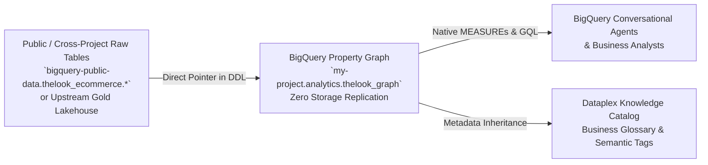

# BigQuery Property Graph Builder & Knowledge Catalog Semantic Layer

This skill provides comprehensive, production-grade instructions for designing, provisioning, validating, and enriching **BigQuery Property Graphs** (`CREATE OR REPLACE PROPERTY GRAPH`) as the canonical semantic layer for data analytics and **BigQuery Conversational Agents** (`geminidataanalytics.googleapis.com`), without requiring intermediate tables or data replication.

---

## 1. Core Architectural Tenet: Zero Intermediate Tables (Direct Source Binding)

When creating property graphs in BigQuery, **never create intermediate physical tables or staging views** unless data transformations (such as casting or pre-filtering) are strictly necessary.



### Key Principles:
1. **Zero Storage Cost & Instant Synchronization**:
   - The Property Graph is a virtual metadata layer created in your project's dataset.
   - It directly binds to source tables across any accessible GCP project (e.g. `bigquery-public-data`, raw ingestion buckets, or cross-project data lakes).
2. **Schema Separation**:
   - Property graphs live in your target project and dataset (e.g. `gricardo-dbx-migration-2026.thelook_ecommerce.thelook_graph`).
   - Node and Edge tables reference fully qualified table paths: \``source_project.source_dataset.source_table`\`.

---

## 2. Canonical DDL Structure with Native Graph MEASURES

A production Property Graph DDL must define:
1. **NODE TABLES**: Primary entities with explicit `KEY`, `LABEL`, and `PROPERTIES`.
2. **EDGE TABLES**: Relationships with `SOURCE KEY`, `DESTINATION KEY`, and directional labels.
3. **Native MEASURES**: In-graph aggregation functions (`MEASURE(SUM(...))`, `MEASURE(AVG(...))`, `MEASURE(COUNT(...))`) with full `OPTIONS(description=..., synonyms=[...])`.

### Complete Canonical Template:

```sql
CREATE OR REPLACE PROPERTY GRAPH `my-project.target_dataset.enterprise_graph`
  NODE TABLES (
    -- Node 1: Customer Entity
    `source-project.source_dataset.users` AS Customer
      KEY (id)
      LABEL Customer
      PROPERTIES (
        id OPTIONS(description="Unique global Customer ID", synonyms=["user_id", "client_id", "id_cliente"]),
        first_name OPTIONS(description="Customer first name", synonyms=["nome", "given_name"]),
        last_name OPTIONS(description="Customer last name", synonyms=["sobrenome", "surname"]),
        country OPTIONS(description="Country of residence", synonyms=["pais", "nacao"]),
        created_at OPTIONS(description="Timestamp of user signup", synonyms=["data_cadastro", "signup_date"]),
        -- Node-level Native MEASUREs
        MEASURE(COUNT(id)) AS total_customers OPTIONS(
          description="Total number of registered customers",
          synonyms=["customer_count", "total_users", "user_count", "total_clientes"]
        ),
        MEASURE(AVG(age)) AS avg_customer_age OPTIONS(
          description="Average customer age in years",
          synonyms=["idade_media", "mean_age"]
        )
      ),

    -- Node 2: Product Entity
    `source-project.source_dataset.products` AS Product
      KEY (id)
      LABEL Product
      PROPERTIES (
        id OPTIONS(description="Unique global Product ID", synonyms=["product_id", "id_produto", "sku_id"]),
        category OPTIONS(description="Product commercial category", synonyms=["categoria", "product_category"]),
        brand OPTIONS(description="Brand or manufacturer", synonyms=["marca", "brand_name"]),
        cost OPTIONS(description="Unit cost of acquisition", synonyms=["custo_unitario", "unit_cost"]),
        retail_price OPTIONS(description="List retail price", synonyms=["preco_venda", "preco_tabela"]),
        -- Product MEASUREs
        MEASURE(COUNT(id)) AS total_products OPTIONS(
          description="Total count of cataloged products",
          synonyms=["product_count", "total_skus"]
        ),
        MEASURE(AVG(retail_price)) AS avg_retail_price OPTIONS(
          description="Average retail list price of products",
          synonyms=["preco_medio", "average_price"]
        )
      ),

    -- Node 3: Order Entity
    `source-project.source_dataset.orders` AS OrderNode
      KEY (order_id)
      LABEL OrderNode
      PROPERTIES (
        order_id OPTIONS(description="Unique global Order ID", synonyms=["id_pedido", "order_number"]),
        user_id OPTIONS(description="Foreign key to purchasing customer", synonyms=["customer_id"]),
        status OPTIONS(description="Order status: Complete, Shipped, Processing, Cancelled, Returned", synonyms=["order_status", "situacao_pedido"]),
        created_at OPTIONS(description="Order placement timestamp", synonyms=["data_compra", "order_date"]),
        -- Order MEASUREs
        MEASURE(COUNT(order_id)) AS total_orders OPTIONS(
          description="Total count of placed orders",
          synonyms=["order_count", "quantidade_pedidos"]
        )
      )
  )
  EDGE TABLES (
    -- Edge 1: Customer -> Placed -> OrderNode
    `source-project.source_dataset.orders` AS PlacedEdge
      SOURCE KEY (user_id) REFERENCES Customer (id)
      DESTINATION KEY (order_id) REFERENCES OrderNode (order_id)
      LABEL PLACED,

    -- Edge 2: OrderNode -> Contains Item -> Product (with Edge Properties & MEASUREs)
    `source-project.source_dataset.order_items` AS ContainsItemEdge
      SOURCE KEY (order_id) REFERENCES OrderNode (order_id)
      DESTINATION KEY (product_id) REFERENCES Product (id)
      LABEL CONTAINS_ITEM
      PROPERTIES (
        id OPTIONS(description="Order item unique identifier", synonyms=["id_item"]),
        status OPTIONS(description="Status of individual item", synonyms=["item_status"]),
        sale_price OPTIONS(description="Actual billed price of item", synonyms=["valor_venda", "item_price"]),
        -- Edge-level MEASUREs
        MEASURE(SUM(sale_price)) AS total_gross_revenue OPTIONS(
          description="Total gross revenue from sold items",
          synonyms=["faturamento_bruto", "total_revenue", "receita_total"]
        ),
        MEASURE(AVG(sale_price)) AS avg_sale_price OPTIONS(
          description="Average item sale price (Ticket médio por item)",
          synonyms=["ticket_medio_item", "average_item_price"]
        ),
        MEASURE(COUNT(id)) AS total_items_sold OPTIONS(
          description="Total count of line items sold",
          synonyms=["itens_vendidos", "volume_vendas"]
        )
      )
  );
```

---

## 3. Querying & Fan-Out Prevention (`AGG()`)

In relational joins, multi-hop paths ($N:M$) produce Cartesian duplicate rows (fan-out). When querying property graphs containing measures declared with `MEASURE(...)`, BigQuery GQL uses the **`AGG()`** function to compute mathematically exact aggregations across graph paths.

### Correct Syntax Example:
```sql
GRAPH `my-project.target_dataset.enterprise_graph`
MATCH (c:Customer)-[:PLACED]->(o:OrderNode)-[item:CONTAINS_ITEM]->(p:Product)
WHERE o.status = 'Complete'
RETURN
  c.country,
  p.category,
  AGG(item.total_gross_revenue) AS faturamento,
  AGG(c.total_customers) AS clientes_unicos
ORDER BY faturamento DESC
LIMIT 10;
```

---

## 4. Dataplex Knowledge Catalog Integration

BigQuery Conversational Agents rely on Dataplex Knowledge Catalog for semantic search, business terminology, and synonym expansion.

### 4.1. Enriching Knowledge Catalog for Graph Grounding
1. **Business Glossary**:
   - Define canonical enterprise terms (e.g. `Gross Revenue`, `Active Customer`, `Order Lead Time`, `IP Collision Ring`).
   - Map Glossary Terms to Node labels and Edge measures.
2. **Metadata Tag Templates**:
   - Create a Tag Template `semantic_graph_metadata` with fields:
     * `is_graph_entity` (BOOLEAN)
     * `entity_type` (ENUM: `NODE`, `EDGE`, `MEASURE`)
     * `business_owner` (STRING)
     * `data_classification` (ENUM: `PUBLIC`, `INTERNAL`, `CONFIDENTIAL`, `RESTRICTED`)
3. **Column-Level Descriptions & Synonyms**:
   - Always ensure source tables or graph DDL options specify rich `description` and `synonyms` arrays, which are automatically indexed by Knowledge Catalog.

---

## 5. Automated Validation & Auto-Discovery

To verify that a Property Graph exists and inspect its metadata in BigQuery:

```sql
-- Check if Property Graph exists
SELECT property_graph_name, property_graph_schema, last_modified_time
FROM `my-project.target_dataset.INFORMATION_SCHEMA.PROPERTY_GRAPHS`;

-- Check Node and Edge tables
SELECT *
FROM `my-project.target_dataset.INFORMATION_SCHEMA.PROPERTY_GRAPH_ELEMENT_TABLES`
WHERE property_graph_name = 'enterprise_graph';
```

---

## 6. Related References

- [Property Graph DDL Best Practices](references/property_graph_ddl_best_practices.md)
- [Knowledge Catalog Semantic Enrichment Guide](references/knowledge_catalog_enrichment.md)
- [BigQuery Conversational Agent Builder](../bigquery-conversational-agent-builder/SKILL.md)
