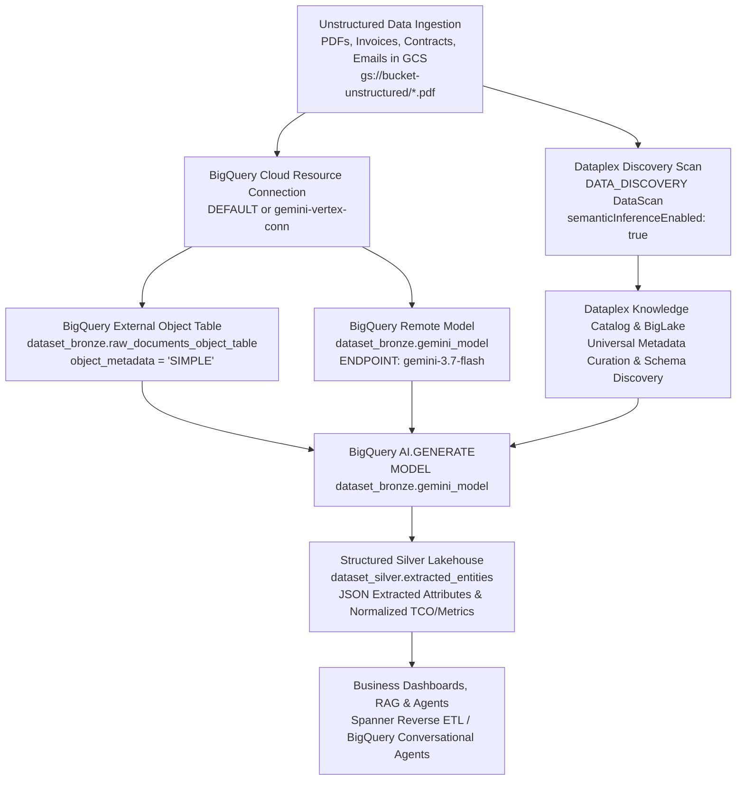

# Dataplex Knowledge Catalog & Cloud Storage Discovery Scan with BigQuery AI.GENERATE (Gemini 3.7 Flash)

This skill provides comprehensive, production-grade instructions, scripts, and SQL/REST templates for implementing the **End-to-End Cloud Storage Entity Discovery & Extraction** workflow across any Google Cloud project. It unifies **Google Cloud Storage (GCS)**, **Dataplex Knowledge Catalog Discovery Scans (`DATA_DISCOVERY`)**, **BigLake External Object Tables**, and **BigQuery Remote Foundation Models (`gemini-3.7-flash` via `AI.GENERATE`)**.

---

## 1. End-to-End Architecture Overview



---

## 2. Mandatory Pre-requisites & IAM Role Bindings

Before executing Discovery Scans and AI extraction, the following Google Cloud services and IAM roles must be enabled and provisioned.

### 2.1. Required APIs
Enable the following APIs in the target project:
```bash
gcloud services enable \
  dataplex.googleapis.com \
  bigquery.googleapis.com \
  bigqueryconnection.googleapis.com \
  aiplatform.googleapis.com \
  storage.googleapis.com \
  datalineage.googleapis.com
```

### 2.2. IAM Permissions Matrix
| Principal | Role | Purpose |
| :--- | :--- | :--- |
| **BigQuery Connection Service Account** (`service-{projectNumber}@gcp-sa-bigqueryconnection.iam.gserviceaccount.com` or Cloud Resource SA) | `roles/storage.objectViewer` | Read access to files inside the Cloud Storage bucket |
| **BigQuery Connection Service Account** | `roles/aiplatform.user` | Invoking Gemini models via Vertex AI connection |
| **Dataplex Service Agent** (`service-{projectNumber}@gcp-sa-dataplex.iam.gserviceaccount.com`) | `roles/dataplex.admin`<br>`roles/bigquery.admin`<br>`roles/bigquery.dataViewer`<br>`roles/bigquery.connectionUser`<br>`roles/datalineage.admin` | Publishing discovered BigLake tables and curating entries in Dataplex Knowledge Catalog |

### 2.3. IAM Grant Script (CLI)
```bash
PROJECT_ID="<YOUR_PROJECT_ID>"
PROJECT_NUMBER=$(gcloud projects describe ${PROJECT_ID} --format="value(projectNumber)")
BUCKET_NAME="<YOUR_BUCKET_NAME>"

# 1. Dataplex Service Agent IAM
gcloud projects add-iam-policy-binding ${PROJECT_ID} \
  --member="serviceAccount:service-${PROJECT_NUMBER}@gcp-sa-dataplex.iam.gserviceaccount.com" \
  --role="roles/dataplex.admin"

gcloud projects add-iam-policy-binding ${PROJECT_ID} \
  --member="serviceAccount:service-${PROJECT_NUMBER}@gcp-sa-dataplex.iam.gserviceaccount.com" \
  --role="roles/bigquery.admin"

# 2. Grant Object Viewer on the target bucket to the BigQuery Connection SA
# (Obtain SA email from: gcloud connections describe gemini-vertex-conn --location=us-central1)
CONNECTION_SA=$(gcloud connections describe gemini-vertex-conn --location=us-central1 --project=${PROJECT_ID} --format="value(cloudResource.serviceAccountId)")
gcloud storage buckets add-iam-policy-binding gs://${BUCKET_NAME} \
  --member="serviceAccount:${CONNECTION_SA}" \
  --role="roles/storage.objectViewer"
```

---

## 3. Step-by-Step Implementation Guide

### Step 1: Create Regional BigQuery Cloud Resource Connection
BigQuery requires a Cloud Resource Connection to read GCS object metadata and invoke Vertex AI Gemini models (or `REMOTE WITH CONNECTION DEFAULT`).

```bash
# Create connection if it doesn't already exist
bq mk --connection \
  --location=us-central1 \
  --project_id=${PROJECT_ID} \
  --connection_type=CLOUD_RESOURCE \
  gemini-vertex-conn
```

---

### Step 2: Provision BigQuery External Object Table
An External Object Table exposes unstructured GCS object metadata (URI, size, content type, updated timestamp, and access permissions) directly to BigQuery SQL without duplicating storage.

```sql
-- DDL: Create External Object Table
CREATE OR REPLACE EXTERNAL TABLE `${PROJECT_ID}.${DATASET_BRONZE}.raw_documents_object_table`
WITH CONNECTION `${PROJECT_ID}.us.gemini-vertex-conn`
OPTIONS (
  object_metadata = 'SIMPLE',
  uris = ['gs://${BUCKET_NAME}/*.pdf']
);
```

> [!NOTE]
> For multi-region datasets (`US` or `EU`), the connection name in BigQuery queries should match the dataset multi-region (e.g. `${PROJECT_ID}.us.gemini-vertex-conn`), while the underlying Dataplex DataScan resource is created in a regional location (e.g. `us-central1` or `europe-west1`).

---

### Step 3: Configure and Provision Dataplex Cloud Storage Discovery Scan

Dataplex Discovery Scans (`type: "DATA_DISCOVERY"`) crawl the GCS bucket, infer file formats, detect schemas, and catalog metadata into Dataplex Knowledge Catalog and BigLake.

#### Sanitized Scan ID Naming Convention:
- Lowercase letters, numbers, and hyphens (`[a-z0-9-]`).
- Max length: 63 characters.
- Must start with a letter and end with an alphanumeric character (no trailing hyphens).
- Formula: `${cleanDataset}-${cleanTable}-discovery-scan`.substring(0, 63).replace(/(^-+|-+$)/g, '')

#### REST API Endpoint:
`POST https://dataplex.googleapis.com/v1/projects/${PROJECT_ID}/locations/${REGION}/dataScans?dataScanId=${SCAN_ID}`

#### Request Body Payload:
```json
{
  "type": "DATA_DISCOVERY",
  "data": {
    "resource": "//storage.googleapis.com/projects/${PROJECT_ID}/buckets/${BUCKET_NAME}"
  },
  "executionSpec": {
    "trigger": {
      "onDemand": {}
    }
  },
  "dataDiscoverySpec": {
    "bigqueryPublishingConfig": {
      "tableType": "BIGLAKE",
      "connection": "projects/${PROJECT_ID}/locations/${REGION}/connections/gemini-vertex-conn"
    },
    "storageConfig": {
      "unstructuredDataOptions": {
        "semanticInferenceEnabled": true
      }
    }
  }
}
```

---

### Step 4: Handle LRO (Long Running Operation) & Trigger Scan Run

#### 1. Handle Creation LRO:
When the `POST .../dataScans` request returns HTTP 200/201 with an operation object `{"name": "projects/.../operations/..."}`, poll `GET https://dataplex.googleapis.com/v1/{operation.name}` until `done === true`.

#### 2. Trigger On-Demand Scan Run:
`POST https://dataplex.googleapis.com/v1/projects/${PROJECT_ID}/locations/${REGION}/dataScans/${SCAN_ID}:run`

#### 3. Poll Scan Jobs:
`GET https://dataplex.googleapis.com/v1/projects/${PROJECT_ID}/locations/${REGION}/dataScans/${SCAN_ID}/jobs?pageSize=5`

Check the latest job state:
- `STATE_UNSPECIFIED` / `RUNNING` / `PENDING`: Keep polling (e.g., every 5 seconds).
- `SUCCEEDED`: Scan completed successfully; metadata and BigLake entities are published.
- `FAILED` / `CANCELLED`: Inspect `job.message` for error diagnosis.

---

### Step 5: Provision BigQuery Remote Model with Gemini 3.7 Flash

Provision the BigQuery Remote Model referencing the Vertex AI `gemini-3.7-flash` endpoint using `REMOTE WITH CONNECTION DEFAULT` (or explicit connection):

```sql
-- DDL: Create BigQuery Remote Model with Gemini 3.7 Flash
CREATE OR REPLACE MODEL `${PROJECT_ID}.${DATASET_BRONZE}.gemini_model`
REMOTE WITH CONNECTION DEFAULT
OPTIONS(
  ENDPOINT = 'projects/${PROJECT_ID}/locations/global/publishers/google/models/gemini-3.7-flash'
);
```

> [!TIP]
> `REMOTE WITH CONNECTION DEFAULT` enables zero-configuration Vertex AI model invocation managed directly by BigQuery, with global publisher endpoint `'projects/{PROJECT_ID}/locations/global/publishers/google/models/gemini-3.7-flash'`.

---

### Step 6: BigQuery `AI.GENERATE` Structured Entity Extraction

Execute BigQuery SQL using the Gemini 3.7 Flash remote model (`AI.GENERATE`) to extract structured key-value entities into the Silver layer.

```sql
-- DDL & DML: Silver Layer Extraction Pipeline with Gemini 3.7 Flash
CREATE OR REPLACE TABLE `${PROJECT_ID}.${DATASET_SILVER}.extracted_entities` AS
SELECT
  uri AS gcs_source_uri,
  AI.GENERATE(
    MODEL `${PROJECT_ID}.${DATASET_BRONZE}.gemini_model`,
    '''
    Analyze this raw document (PDF / Invoice / Supplier Quote / Contract).
    Extract and return strictly a valid JSON object matching this schema:
    {
      "entity_name": "string",
      "document_type": "string",
      "document_number": "string",
      "document_date": "YYYY-MM-DD",
      "currency": "string",
      "total_amount": number,
      "tax_amount": number,
      "payment_terms_days": integer,
      "line_items": [
        {
          "sku_code": "string",
          "description": "string",
          "quantity": number,
          "unit_price": number,
          "total_price": number
        }
      ]
    }
    Return only valid JSON without markdown wrapping.
    ''',
    table_column => content
  ) AS raw_json,
  JSON_EXTRACT_SCALAR(raw_json, '$.entity_name') AS entity_name,
  JSON_EXTRACT_SCALAR(raw_json, '$.document_type') AS document_type,
  JSON_EXTRACT_SCALAR(raw_json, '$.document_number') AS document_number,
  SAFE_CAST(JSON_EXTRACT_SCALAR(raw_json, '$.document_date') AS DATE) AS document_date,
  JSON_EXTRACT_SCALAR(raw_json, '$.currency') AS currency,
  SAFE_CAST(JSON_EXTRACT_SCALAR(raw_json, '$.total_amount') AS NUMERIC) AS total_amount,
  SAFE_CAST(JSON_EXTRACT_SCALAR(raw_json, '$.tax_amount') AS NUMERIC) AS tax_amount,
  SAFE_CAST(JSON_EXTRACT_SCALAR(raw_json, '$.payment_terms_days') AS INT64) AS payment_terms_days
FROM `${PROJECT_ID}.${DATASET_BRONZE}.raw_documents_object_table`;
```

---

### Step 7: Verify Assets in Dataplex Knowledge Catalog

Use the Dataplex Universal Catalog search API or CLI to verify that discovered assets, schema fields, and semantic labels are indexed.

```bash
# Semantic Search in Dataplex Knowledge Catalog
gcloud dataplex entries search "unstructured documents" \
  --project="${PROJECT_ID}" \
  --semantic-search \
  --limit=20

# Keyword Search for specific table entry
gcloud dataplex entries search "name:raw_documents_object_table" \
  --project="${PROJECT_ID}" \
  --limit=10
```

---

## 4. Production Best Practices & Troubleshooting

1. **Remote Model Endpoint Syntax**:
   - The canonical `ENDPOINT` for Gemini 3.7 Flash is:
     `'projects/{PROJECT_ID}/locations/global/publishers/google/models/gemini-3.7-flash'`
   - `REMOTE WITH CONNECTION DEFAULT` uses the default cloud resource connection automatically provisioned by BigQuery.

2. **Location Resolution (Multi-Region vs Regional)**:
   - BigQuery datasets often reside in `US` or `EU` (multi-region).
   - Dataplex DataScans require regional endpoints (e.g. `us-central1` for `US`, `europe-west1` for `EU`).
   - Use the helper mapping:
     ```javascript
     const getDataplexRegion = (loc) => (!loc || loc.toLowerCase() === 'us' || loc.toLowerCase() === 'multi-region') ? 'us-central1' : (loc.toLowerCase() === 'eu' ? 'europe-west1' : loc);
     ```

3. **409 Conflict Handling**:
   - If a DataScan ID already exists, the API returns HTTP 409. Treat this as non-fatal, skip creation, and proceed immediately to triggering the `:run` endpoint.

4. **CREATING State Handling**:
   - While a DataScan is in the `CREATING` state, querying the `/jobs` subresource will return a 400 Bad Request error. Check the scan's top-level state first before listing jobs.

5. **Google Account Chooser Link Generation**:
   - Always wrap Cloud Console deep links for users:
     ```typescript
     const formatConsoleUrl = (url: string, userEmail?: string) =>
       userEmail ? `https://accounts.google.com/AccountChooser?Email=${encodeURIComponent(userEmail)}&continue=${encodeURIComponent(url)}` : url;
     ```
