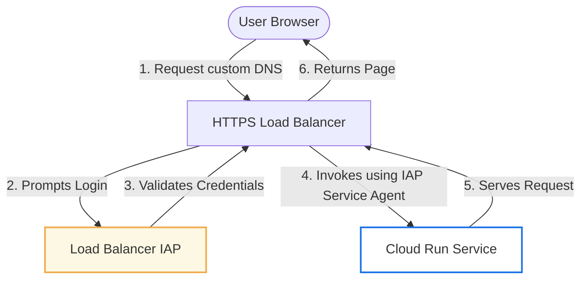

# GCP Cloud Run + Global HTTPS Load Balancer + Identity-Aware Proxy (IAP) Integration Guide

This guide documents the architectural best practices and troubleshooting steps for securing a Google Cloud Run service behind an External Global HTTPS Load Balancer using Identity-Aware Proxy (IAP).

---

## ⚠️ The IAP Double-Securing Conflict (JWT Mismatch)

When securing Cloud Run behind a Load Balancer, a common mistake is to enable **native Cloud Run-level IAP** simultaneously with **Load Balancer-level IAP**. This results in a persistent `403 Forbidden` error.

### Why does this happen?
1. **Load Balancer IAP:** When users visit the custom domain, they authenticate against the Load Balancer's IAP Client ID (e.g., `94990521171-xxxx.apps.googleusercontent.com`). The Load Balancer generates and signs a JWT assertion.
2. **Cloud Run Native IAP:** The Cloud Run service itself is natively protected by a Google-managed system OAuth Client ID (e.g., `369001918367-xxxx.apps.googleusercontent.com`).
3. **The Mismatch:** When the Load Balancer forwards the authenticated request, the native Cloud Run-level IAP attempts to validate the request against its own Client ID. Since the token was generated by the Load Balancer's Client ID, the validation fails, and Cloud Run returns a **GFE Forbidden (403)** error page to the user.

---

## 🏛️ Correct Architecture Pattern (Least Privilege)

To securely configure a Load Balancer with IAP pointing to a Cloud Run service, use the following architecture:



1. **Secure at the Perimeter (Load Balancer):** Turn on IAP **only** at the Load Balancer's Backend Service level.
2. **Restrict Cloud Run Ingress:** Set ingress on Cloud Run to `internal-and-cloud-load-balancing` so it cannot be reached from the public internet.
3. **Restrict Cloud Run Invocation:** Deploy Cloud Run with `--no-allow-unauthenticated` so anonymous requests are blocked.
4. **Authorize the IAP Agent:** Grant the Load Balancer's IAP Service Agent (`service-PROJECT_NUMBER@gcp-sa-iap.iam.gserviceaccount.com`) the `roles/run.invoker` permission on Cloud Run so it can forward authenticated traffic.
5. **Disable Cloud Run Native IAP:** Disable `--iap` directly on the Cloud Run service itself to avoid Client ID token conflicts.

---

## 🛠️ Step-by-Step Resolution & Commands

### Step 1. Disable Native IAP on Cloud Run
If native IAP was accidentally enabled on the Cloud Run service, disable it:
```bash
gcloud beta run services update SERVICE_NAME \
  --region=REGION \
  --project=PROJECT_ID \
  --no-iap
```
> [!WARNING]
> Running `--no-iap` on a Cloud Run service resets its IAM invoker policy. You **must** re-apply the IAP Service Agent's invoker binding after running this command!

### Step 2. Grant Invoker Access to the Load Balancer IAP Agent
Identify the Google-managed IAP Service Agent for your project:
`service-PROJECT_NUMBER@gcp-sa-iap.iam.gserviceaccount.com`

Grant this service account the `roles/run.invoker` role on the Cloud Run service:
```bash
gcloud run services add-iam-policy-binding SERVICE_NAME \
  --region=REGION \
  --project=PROJECT_ID \
  --member="serviceAccount:service-PROJECT_NUMBER@gcp-sa-iap.iam.gserviceaccount.com" \
  --role="roles/run.invoker"
```

### Step 3. Set Ingress and Authentication Controls
Make sure the service remains private and only accepts traffic from the Load Balancer:
```bash
gcloud run services update SERVICE_NAME \
  --region=REGION \
  --project=PROJECT_ID \
  --ingress=internal-and-cloud-load-balancing \
  --no-allow-unauthenticated
```

---

## 💻 Programmatic Deployment Pattern (Shell Scripting)

When writing automated deployment scripts (e.g., `deploy.sh`), implement a flag to selectively bypass native IAP configurations when a Load Balancer is present:

```bash
# Configuration variables in .env / environment
ENABLE_IAP="${ENABLE_IAP:-true}"
LOAD_BALANCER_IAP="${LOAD_BALANCER_IAP:-true}"  # Set to true when deploying with a LB

# Deploy service privately (without public ingress)
gcloud run deploy "${SERVICE_NAME}" \
  --image "${IMAGE}" \
  --project "${PROJECT_ID}" \
  --region "${REGION}" \
  --ingress internal-and-cloud-load-balancing \
  --no-allow-unauthenticated

# Configure IAP permissions
if [[ "${ENABLE_IAP}" == "true" ]]; then
  PROJECT_NUMBER="$(gcloud projects describe "${PROJECT_ID}" --format='value(projectNumber)')"
  IAP_SA="service-${PROJECT_NUMBER}@gcp-sa-iap.iam.gserviceaccount.com"

  # 1. Authorize the IAP service agent to invoke Cloud Run
  gcloud run services add-iam-policy-binding "${SERVICE_NAME}" \
    --region="${REGION}" --project="${PROJECT_ID}" \
    --member="serviceAccount:${IAP_SA}" \
    --role="roles/run.invoker" --quiet >/dev/null

  # 2. Only enable native Cloud Run IAP if NOT using Load Balancer IAP
  if [[ "${LOAD_BALANCER_IAP}" == "true" ]]; then
    echo "ℹ️ Secured via Global Load Balancer IAP. Skipping native Cloud Run IAP to prevent Client ID conflicts."
  else
    echo "🔒 Securing directly via native Cloud Run IAP..."
    gcloud beta run services update "${SERVICE_NAME}" \
      --region="${REGION}" --project="${PROJECT_ID}" --iap
  fi
fi
```
