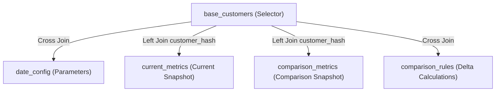

# Looker Period-over-Period (PoP) Modeling & Semantic Reconciliation Guidelines

This skill documents architectural patterns, best practices, and deployment procedures for **Period-over-Period (PoP)** and **Customer 360** LookML modeling on Google Cloud BigQuery.

---

## 1. Looker Semantic Modeling & Surrogate Keys

> [!IMPORTANT]
> **Surrogate Key Resolution Rule**: When underlying physical database tables (e.g. `analytics_mart.customer_snapshot`) do **NOT** contain a physical hash column and only contain raw identifiers (`customer_id` or `tax_id`), any view that acts as a base or join participant must calculate this surrogate key dynamically to avoid `Unrecognized name` SQL runtime execution failures.

### Correct Dynamic Hashing Formula:
Always compute the SHA256 hex string casting the raw column to string:
```lookml
dimension: customer_hash {
  hidden: yes
  type: string
  sql: TO_HEX(SHA256(CAST(${TABLE}.customer_id AS STRING))) ;;
}
```

This pattern should be present in:
* `views/base/base_customers.view.lkml` (as a derived table selector).
* `views/base/customer_snapshot.view.lkml` (base flat view).
* `views/refinements/customer_profile.view.lkml`, `account_metrics.view.lkml`, and `credit_services.view.lkml`.

---

## 2. Resolving LookML Inheritance Clashes (`extends`)

Looker has a strict limitation when extending views: **A view can only contain one active derived table (`derived_table` or physical `sql_table_name` resolution).**

### The Clash:
When comparison views (`current_metrics` and `comparison_metrics`) extend unpivoted persistent derived tables (PDTs) alongside the base view `customer_snapshot`, Looker discards columns from the base view (including dimension attributes like `segment_name`) and only resolves columns from the last extended PDT.

### The Resolution Rule:
1. **Keep Comparison Views Flat**: Views like `current_metrics` and `comparison_metrics` must only extend flat, one-to-one logical entities mapped directly to the primary table.
2. **Approved Extends Block**:
```lookml
view: current_metrics {
  extends: [
    customer_snapshot,
    customer_profile,
    account_metrics,
    credit_services
  ]
}
```
3. **Do not include unpivoted PDTs** in base extends. All PoP comparison rules in `comparison_rules.view.lkml` must rely on flat dimensions and measures.

---

## 3. Period-over-Period (PoP) Architecture

The `customer_360_pop` explore is structured as a high-performance semantic join:



### Components:
* **`base_customers`**: Selects distinct customer identifiers present in either the current date filter or the comparison date filter.
* **`date_config`**: Cross joined to resolve `current_date` and `comparison_date` parameters dynamically.
* **`current_metrics` & `comparison_metrics`**: Left joined on `customer_hash` and snapshot date matching.
* **`comparison_rules`**: Cross joined to compute absolute deltas (`COALESCE(Current, 0) - COALESCE(Comparison, 0)`) and percentage deltas (`SAFE_DIVIDE(Current - Comparison, Comparison)`).

---

## 4. Deploying to Looker Production

If developer branch files diverge from the remote `main` branch, deploying directly can result in a `non-fast-forward` Git rejection.

### Production Deployment Flow:
1. Push local changes to the Git repository:
   ```bash
   git add .
   git commit -m "feat: updated LookML models"
   git push origin main
   ```
2. Execute automated deployment via Looker Python SDK:
   * Put Looker session into `dev` mode.
   * Switch Looker workspace to `main`.
   * Reset local workspace to Git remote (`reset_project_to_remote`).
   * Perform LookML project validation (`validate_project`).
   * Publish to production (`deploy_to_production`).

---

## 5. Resilient BigQuery Data Loading

When loading massive historical sample or test datasets (e.g. hundreds of thousands of snapshot rows across thousands of entities over time) to BigQuery in Python, client libraries can occasionally encounter connection mutation limits during large uploads.

### Recommended CLI Subprocess Pattern:
Using `subprocess` to call the native `bq load` CLI utility is lightweight, robust, and fast for NDJSON datasets:

```python
import subprocess

cmd = [
    "bq", "load",
    f"--project_id={project_id}",
    "--source_format=NEWLINE_DELIMITED_JSON",
    "--replace",
    f"{project_id}:{dataset_id}.{table_id}",
    ndjson_path
]
subprocess.run(cmd, check=True)
```
